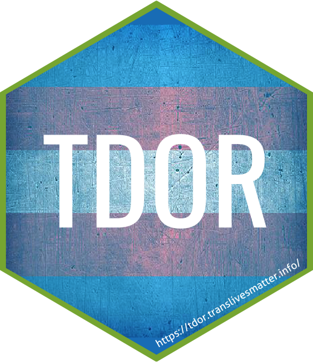

<!-- README.md is generated from README.Rmd. Please edit that file -->

```{r setup, include = FALSE}
knitr::opts_chunk$set(
  collapse = TRUE,
  comment = "#>",
  fig.path = "man/figures/README-",
  out.width = "100%"
)
```

# tdor

**tdor** provides data on killings and suicides of transgender people, as 
memorialized in the Transgender Day of Remembrance 2007-2018.




## Installation

You can install tdor via:

``` r
library(remotes)
install_github("CaRdiffR/tdor")
```
