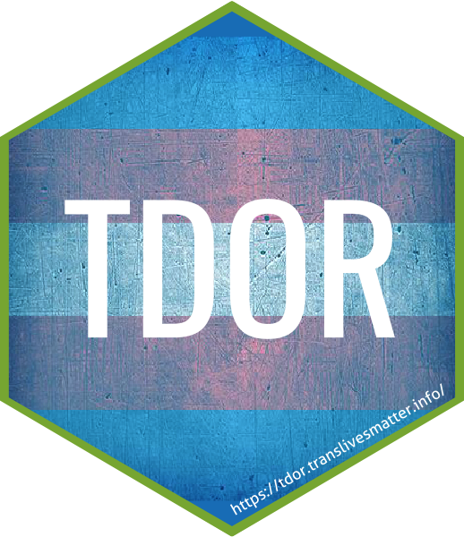

<!-- README.md is generated from README.Rmd. Please edit that file -->

# tdor

**tdor** provides data on killings and suicides of transgender people,
as memorialized in the Transgender Day of Remembrance 2007-2018.




## Installation

You can install tdor via:

``` r
library(remotes)
install_github("CaRdiffR/tdor")
```
